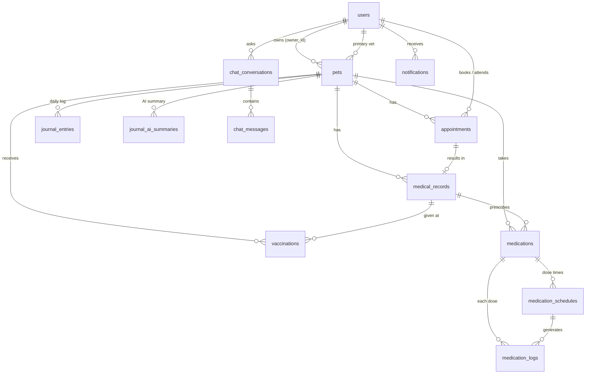

# PawRecord — Database

There are two ways to create the same database. Use **one** of them:

| Way | When to use it |
|---|---|
| **A. CodeIgniter migrations** (`php spark migrate`) **(recommended)** | Normal setup. Later steps add new migrations, and `php spark migrate` applies them. |
| **B. `pawrecord_schema.sql`** in phpMyAdmin | Quick look at the schema, or on a PC with no Shell access. Don't mix it with A on the same database. |

Both create the same 13 tables and 2 views. This was verified by comparing every column, index, foreign key and CHECK rule. The tables start **empty**: accounts are created inside the system (first-time Admin setup, Pet Owner sign-up).

## A. Migrations (recommended)
1. phpMyAdmin → create an empty database **`pawrecord_db`** with collation `utf8mb4_unicode_ci`.
2. In the XAMPP Shell, inside the project folder:
   ```bat
   php spark migrate
   ```
The migration files are in `app/Database/Migrations/`.

## B. SQL file
phpMyAdmin → **Import** → `pawrecord_schema.sql` → **Go**. The file creates `pawrecord_db` by itself and drops and recreates everything if run again.

Requirements: MariaDB 10.4+ (included in every XAMPP with PHP 8.2+) or MySQL 8.0.16+. The `CHECK` rules are enforced only on those versions.

## `pawrecord_seed.sql`: for testing only
Sample records (sample users, the pet Luna, medications, journal entries). It is **not** part of the setup. Import it only into a test copy of the database when you want to try screens with data. Its accounts use the password `password123`.

## Which tables serve which feature and problem

| Problem | Feature | Tables |
|---|---|---|
| Owners don't understand vet terms | AI Medical Chatbot | `chat_conversations`, `chat_messages`, `medical_records.owner_summary` |
| Health records are scattered across visits | Digital Pet Health Timeline | `medical_records`, `vaccinations`, `appointments`, plus the **view** `pet_health_timeline` |
| Owners forget medications | Medication Adherence Tracker | `medications`, `medication_schedules`, `medication_logs`, plus the **view** `medication_adherence` |
| Owners can't recall condition changes | AI Symptom & Behavior Journal | `journal_entries` (one per pet per day), `journal_ai_summaries` |
| Used by all features | Accounts, pets, alerts | `users` (role `owner`/`vet`/`admin`), `pets`, `notifications` |

## Relationships



## Design rules
- **Deleting a pet** also deletes its appointments, records, vaccinations, medications, dose logs, journal entries and AI summaries (`ON DELETE CASCADE`).
- **Deleting a vet or staff account** keeps the medical history. Their references (`vet_id`, `prescribed_by`, and so on) become `NULL` (`ON DELETE SET NULL`). Users and pets also have a `deleted_at` column, so the app can archive them instead of deleting.
- **The database blocks duplicates:**
  - an email can be used once;
  - a pet gets one journal entry per day;
  - a medication gets one log row per scheduled dose time;
  - a visit gets one medical record.
- **Dose statuses:** each dose starts as `pending`. When the owner taps **Mark** it becomes `taken`. If the time passes without that, a scheduled job (added in a later step) sets it to `missed` and creates a `notifications` row.
- **Adherence formula:** `taken ÷ (taken + missed + skipped)`. Completion is `taken ÷ total_doses`. The `medication_adherence` view calculates both.
- **Journal scores** use 1–5 scales (appetite, activity, sleep quality) so the AI can spot trends, such as "appetite dropped from 3 to 2 over 2 days".
- **Indexes** cover the common lookups:
  - a pet's timeline (`pet_id, visit_date`);
  - a vet's schedule (`vet_id, scheduled_at`);
  - doses due now (`status, scheduled_for`);
  - unread alerts (`user_id, read_at`).

## Useful queries
```sql
-- Luna's full health timeline
SELECT * FROM pet_health_timeline WHERE pet_id = 1 ORDER BY event_date DESC;

-- Today's alerts: doses still pending today
SELECT m.name, m.dosage, m.instructions, l.scheduled_for
  FROM medication_logs l JOIN medications m ON m.id = l.medication_id
 WHERE m.pet_id = 1 AND l.status = 'pending' AND DATE(l.scheduled_for) = CURDATE()
 ORDER BY l.scheduled_for;

-- Is today's journal logged?
SELECT COUNT(*) = 0 AS journal_missing FROM journal_entries WHERE pet_id = 1 AND entry_date = CURDATE();

-- Adherence per medication
SELECT name, doses_taken, doses_missed, adherence_pct FROM medication_adherence WHERE pet_id = 1;
```
